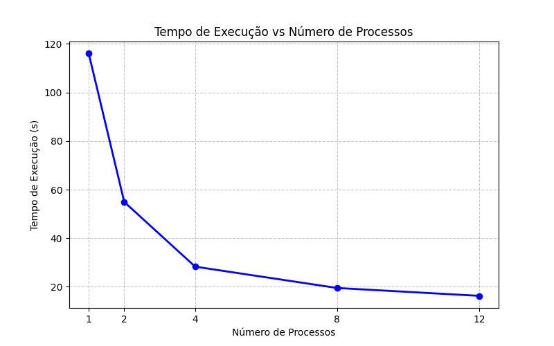
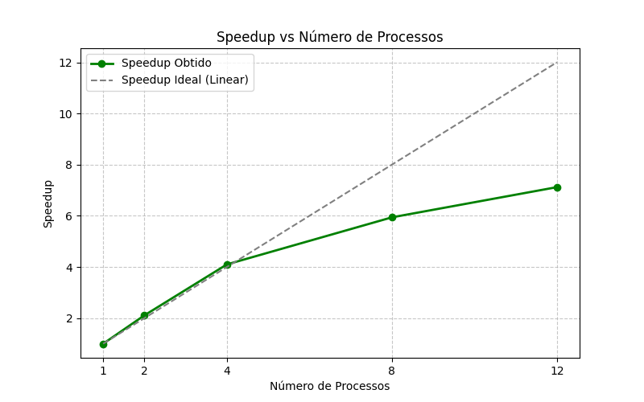
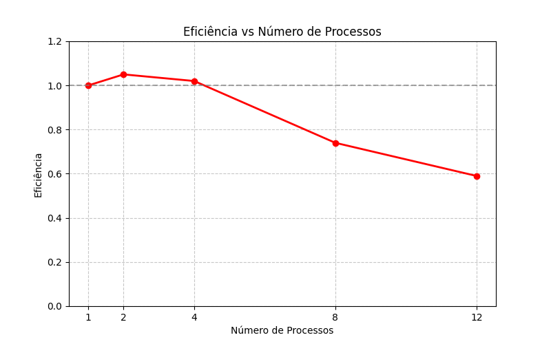

# Relatório da Atividade: Paralelização de Avaliador de Arquivos de Log

**Disciplina:** PROGRAMAÇÃO CONCORRENTE E DISTRIBUÍDA
**Aluno(s):** Arthur Dias
**Turma:** Manhã
**Professor:** Rafael
**Data:** 20/03/2026

---

# 1. Descrição do Problema

O problema computacional resolvido consiste em analisar um grande volume de arquivos de texto (logs) para extrair métricas gerenciais, especificamente: contagem total de linhas, palavras, caracteres e a ocorrência de palavras-chave específicas ("erro", "warning" e "info").

* **Qual problema foi implementado:** A refatoração de um sistema de leitura sequencial (serial) para um modelo paralelo utilizando múltiplos processos.
* **Qual algoritmo foi utilizado:** Foi implementada a arquitetura Produtor-Consumidor utilizando uma fila (`Queue`) com buffer limitado para distribuir os caminhos dos arquivos entre os processos trabalhadores (consumidores).
* **Qual o tamanho da entrada utilizada nos testes:** Foram processados 1000 arquivos de log (pasta `log2`), totalizando 10 milhões de linhas e 200 milhões de palavras.
* **Qual o objetivo da paralelização:** Reduzir o tempo elevado de execução do modelo serial, aproveitando múltiplos núcleos do processador para ler e processar vários arquivos simultaneamente.

---

# 2. Ambiente Experimental

Os testes foram executados no seguinte ambiente de hardware e software:

| Item                        | Descrição |
| --------------------------- | --------- |
| Processador                 | Intel Core i5-12500 3.00 GHz |
| Número de núcleos           | 6 físicos, 12 lógicos |
| Memória RAM                 | 16 GB |
| Sistema Operacional         | Windows 11 Pro |
| Linguagem utilizada         | Python |
| Biblioteca de paralelização | `multiprocessing` |
| Compilador / Versão         | [EX: Python 3.10] |

---

# 3. Metodologia de Testes

* O tempo de execução foi medido internamente no script Python utilizando a função `time.time()`, calculando a diferença entre o início e o fim da execução da função principal.
* O tamanho da entrada foi mantido constante em todas as rodadas (1000 arquivos da pasta `log2`).
* A carga de trabalho contava com uma simulação de processamento pesado (loop interno de 1000 iterações na função de leitura) para simular cenários reais.

### Configurações testadas

Os experimentos foram realizados nas seguintes configurações:

* 1 thread/processo (versão serial original)
* 2 threads/processos
* 4 threads/processos
* 8 threads/processos
* 12 threads/processos

---

# 4. Resultados Experimentais

Os tempos totais de execução obtidos no experimento foram:

| Nº Threads/Processos | Tempo de Execução (s) |
| -------------------- | --------------------- |
| 1                    | 115.9621              |
| 2                    | 54.9234               |
| 4                    | 28.2943               |
| 8                    | 19.5221               |
| 12                   | 16.2943               |

---

# 5. Cálculo de Speedup e Eficiência

## Fórmulas Utilizadas

### Speedup
`Speedup(p) = T(1) / T(p)`
Onde **T(1)** = tempo da execução serial e **T(p)** = tempo com p processos.

### Eficiência
`Eficiência(p) = Speedup(p) / p`
Onde **p** = número de processos.

---

# 6. Tabela de Resultados

| Threads/Processos | Tempo (s) | Speedup | Eficiência |
| ----------------- | --------- | ------- | ---------- |
| 1                 | 115.96    | 1.00    | 1.00       |
| 2                 | 54.92     | 2.11    | 1.05       |
| 4                 | 28.29     | 4.10    | 1.02       |
| 8                 | 19.52     | 5.94    | 0.74       |
| 12                | 16.29     | 7.12    | 0.59       |

*(Nota: Valores de eficiência ligeiramente acima de 1.0 em configurações iniciais sugerem ganhos de cache ou variações de overhead do SO durante a execução serial base).*

---

# 7. Gráfico de Tempo de Execução

---

# 8. Gráfico de Speedup

---

# 9. Gráfico de Eficiência

---

# 10. Análise dos Resultados

**O speedup obtido foi próximo do ideal?**
Nas configurações de 2 e 4 processos, o speedup foi excelente e praticamente ideal (superlinear), demonstrando que o problema é altamente paralelizável. Ao escalar para 8 e 12 processos, o speedup continuou crescendo, mas começou a se afastar da linha ideal linear.

**A aplicação apresentou escalabilidade?**
Sim. A aplicação escalou muito bem, reduzindo o tempo de quase 116 segundos para cerca de 16 segundos.

**Em qual ponto a eficiência começou a cair?**
A eficiência manteve-se no topo até os 4 processos. A partir de 8 processos, a eficiência caiu para 0.74, e com 12 processos, caiu para 0.59.

**Houve overhead de paralelização?**
Sim, especialmente notável nas configurações de 8 e 12 processos. A queda na eficiência indica que o custo (overhead) de gerenciar as filas do sistema operacional (criação de processos, trocas de contexto e controle do buffer de IPC - Inter-Process Communication) começou a competir com o ganho de velocidade. Além disso, a contenção pode ter sido gerada por estarmos ultrapassando o número de núcleos físicos reais do processador ou atingindo o limite de velocidade de leitura do disco rígido/SSD (I/O bound).

---

# 11. Conclusão

O paralelismo trouxe um ganho extremamente significativo de desempenho para o problema de análise de logs. Implementar o padrão Produtor-Consumidor provou ser a estratégia correta, transformando uma tarefa demorada em uma execução ágil.

O melhor número de processos para manter a relação custo-benefício (alta velocidade sem desperdício extremo de recursos) ficou na casa dos **4 a 8 processos**, onde a eficiência se manteve aceitável. Embora o teste com 12 processos tenha entregue o menor tempo absoluto (16.29s), a eficiência de 59% mostra que adicionar mais processos além desse ponto traria retornos cada vez menores (Lei de Amdahl). O sistema está funcional, escalável e pronto para uso em produção.
